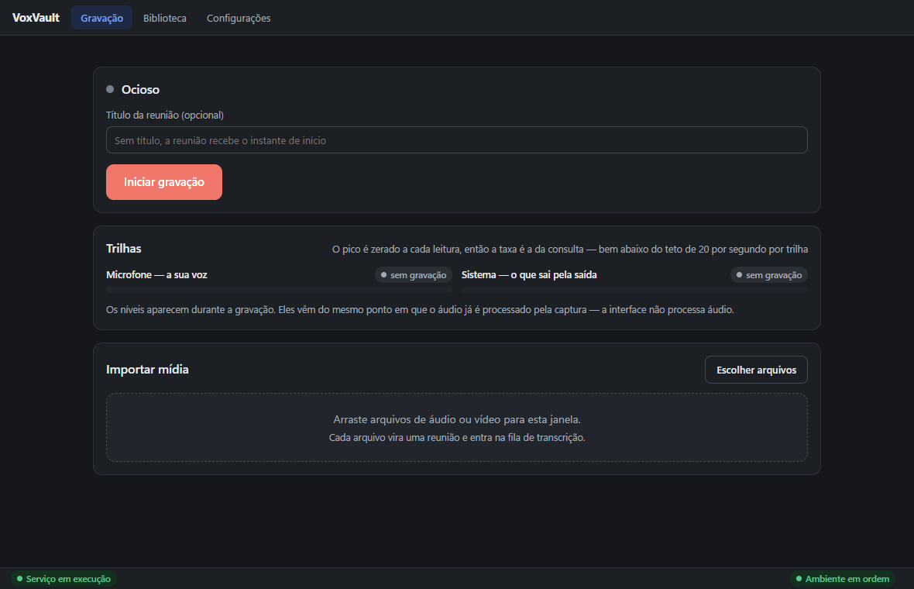
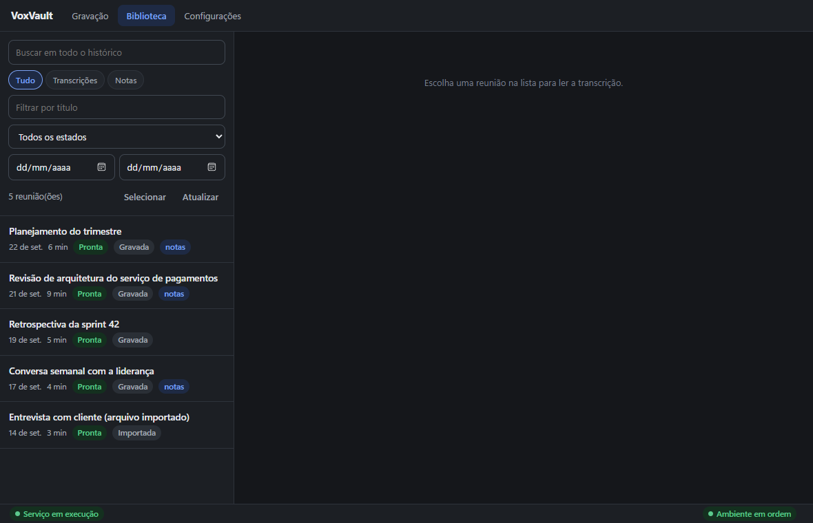
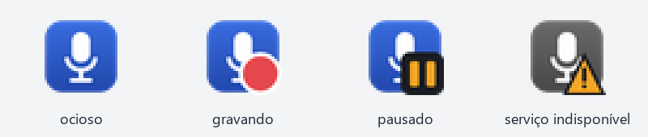
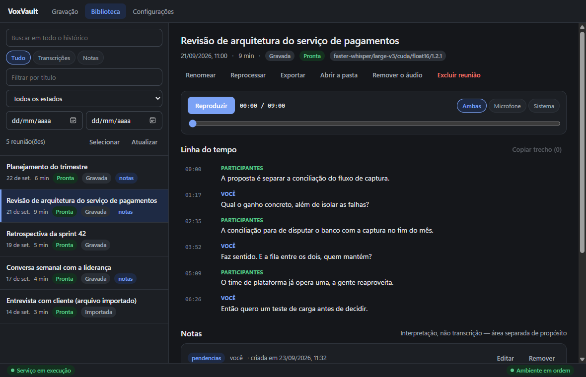

# VoxVault

Grava, transcreve e indexa suas reuniões no seu computador, sem depender da
plataforma de reunião e sem mandar nada para fora.

O VoxVault grava duas trilhas ao mesmo tempo: o seu microfone e a mistura que o
Windows está reproduzindo. É essa separação física que diz quem falou, sem
modelo de diarização e sem precisar que Teams, Meet ou Zoom cooperem. Nenhum
bot entra na chamada e nenhuma permissão é pedida à plataforma. A transcrição
roda depois, na sua máquina, com o Whisper; o resultado fica pesquisável e
disponível para um agente como o Claude pelo protocolo MCP.



## Por que existe

Ferramentas de transcrição de reunião costumam mandar o áudio para a nuvem,
entrar na chamada como um participante ou exigir a plataforma certa. As que
rodam localmente no Windows costumam ser pesadas demais para ficar abertas o
dia inteiro. O VoxVault parte de três decisões:

- **Local.** Áudio e transcrição nunca saem da máquina. Depois do preparo, o
  VoxVault funciona sem rede.
- **Leve.** Recolhido na bandeja, o conjunto inteiro (aplicativo e serviço)
  ocupa cerca de 32 MB e 0,01% de processador; gravando, cerca de 70 MB e
  0,2%. Durante a reunião a máquina **só grava**; a transcrição roda depois e
  é interrompida se você começar a gravar de novo.
- **Registro fiel.** O que foi dito não é editável, nem por você nem por um
  agente. Notas ficam ao lado, nunca por cima.

## Recursos

- Gravação em duas trilhas (microfone e sistema), sem perdas (FLAC), com
  pausa, retomada e avisos quando um dispositivo some, o microfone fica mudo ou
  a trilha do sistema fica em silêncio. Com um headset numa chamada, a trilha do
  sistema grava a saída de chamada do headset, que é por onde a chamada toca, e
  uma trilha que perde o dispositivo volta a gravar quando ele reaparece.
- Transcrição local com `faster-whisper`, na GPU NVIDIA quando houver e na CPU
  quando não houver, com o modelo escolhido pelo hardware.
- Biblioteca com busca que ignora acentos, linha do tempo por falante e
  reprodução do trecho ao clicar no texto.
- Importação de áudio e vídeo já existentes (`.opus`, `.m4a`, `.mp3`, `.wav`,
  `.flac`, `.mp4`, `.mkv`, `.webm` e outros), sem ffmpeg.
- Bandeja residente, atalho global, início com o Windows e notificações.
- Detecção de reunião: quando um aplicativo de chamada abre o microfone, o
  VoxVault sugere gravar. Não lê áudio nem título de janela.
- Exclusão definitiva, uma a uma ou em lote, com prévia do que será apagado.
- Servidor MCP para o Claude Desktop e o Codex, só de leitura e notas.
- Linha de comando completa para tudo isso.



## Requisitos

- Windows 10 ou 11, 64 bits.
- Espaço em disco: cerca de 2 GB sem GPU; cerca de 5,5 GB com GPU NVIDIA
  (ambiente, componentes CUDA e o modelo maior), mais cerca de 120 MB por hora
  de reunião gravada.
- Opcional: GPU NVIDIA com driver recente. Com 5600 MB de memória de vídeo ou
  mais (placas de 6 GB), o modelo é o `large-v3`; a partir de 2500 MB, o
  `large-v3-turbo` na GPU. Sem GPU, o `large-v3-turbo` roda na CPU, a cerca de
  1,4 vez o tempo real num processador de 6 núcleos: uma reunião de 1 h leva por
  volta de 45 min.
- Conexão com a internet só para o preparo do primeiro uso.

Nada técnico precisa estar instalado antes: nem Python, nem uv, nem ffmpeg.

## Instalação e primeiro uso

1. Baixe `VoxVault-X.Y.Z-setup.exe` da página de
   [releases](https://github.com/erielmiquilino/voxvault/releases) e, se
   quiser, confira a soma em `SHA256SUMS.txt`.
2. Execute o instalador. Ele instala só para o seu usuário, sem pedir
   administrador.
3. O executável **não é assinado**, então o Windows SmartScreen avisa na
   primeira execução: clique em **Mais informações → Executar assim mesmo**.
4. Na primeira abertura, a tela de preparo mostra o hardware encontrado, a
   pasta de dados sugerida com o espaço livre e o que será baixado, com o
   tamanho de cada parte. Nada é baixado antes de você confirmar.

O que o preparo baixa (tamanhos da versão 0.1.0):

| Parte | Download | Em disco | Quando |
|---|---|---|---|
| Interpretador Python 3.12 | 21 MB | 60 MB | sempre |
| Dependências do núcleo (50 pacotes) | 96 MB | 275 MB | sempre |
| Aceleração por GPU (CUDA) | 1,3 GB | 2,0 GB | só com GPU NVIDIA |
| Modelo `large-v3` | 2,9 GB | 2,9 GB | GPU com 5600 MB ou mais |
| Modelo `large-v3-turbo` | 1,5 GB | 1,5 GB | GPU menor, ou sem GPU |

No total, cerca de 4,3 GB numa máquina com GPU de 8 GB e 1,6 GB numa máquina
sem GPU. O preparo pode ser interrompido e retomado: o que já foi baixado é
aproveitado. Antivírus às vezes estranham um programa que baixa e executa um
interpretador; se o seu bloquear o preparo, a tela diz qual arquivo e o que
fazer.

Antivírus com proteção de acesso ao microfone, como o Kaspersky, seguram o
áudio do serviço do VoxVault até você responder ao aviso deles: na primeira
gravação, procure esse aviso e permita, marcando para lembrar a escolha. Sem
isso a gravação não começa, e o VoxVault diz que o fluxo de áudio não abriu.
Numa máquina corporativa a proteção pode só recusar, sem aviso nenhum: aí o
diagnóstico (`voxvault doctor`) e o erro ao gravar dizem quais executáveis do
VoxVault a TI precisa liberar.

## Uso

**Bandeja.** Fechar ou minimizar a janela recolhe o VoxVault para a bandeja,
e a janela deixa de existir, o que libera o navegador embutido. O ícone muda
com o estado (ocioso, gravando, pausado, serviço indisponível), e o menu inicia,
pausa e encerra gravações sem abrir janela. "Sair do VoxVault" pede
confirmação se houver gravação em andamento.



**Atalho.** `Alt+Shift+R` inicia e encerra a gravação de qualquer lugar,
inclusive com outro aplicativo em tela cheia. O atalho é configurável; uma
combinação já ocupada é recusada e a anterior continua valendo.

**Detecção de reunião.** Quando um aplicativo de chamada conhecido abre o
microfone, uma notificação oferece "Gravar". Ela vale por 2 minutos; depois
disso, clicar só abre a janela.

**Importação.** Arraste arquivos de áudio ou vídeo para a tela de Gravação, ou
escolha-os em "Importar mídia". O áudio é lido pela biblioteca de mídia
embutida no ambiente, sem ffmpeg.

**Exclusão.** Na reunião, ou em lote pela seleção da Biblioteca. A prévia
mostra o que será apagado (áudio, transcrições, notas e o tamanho total) antes
da confirmação, e uma reunião gravando ou transcrevendo é recusada.



## Integração com o Claude Desktop

Em Configurações → Registro do servidor MCP, "Registrar automaticamente" grava
o servidor MCP do VoxVault no Claude Desktop e no Codex, preservando os outros
servidores e copiando o arquivo antes de mexer. Reinicie o cliente depois. Pela
linha de comando, é `voxvault mcp --apply`.

O agente pode ler transcrições, recortar por intervalo de tempo, buscar em todo
o histórico e gravar notas. **Não pode** apagar reunião, alterar segmento,
remover áudio nem disparar gravação: a transcrição é o registro do que foi
dito, e um agente capaz de editá-la a tornaria inútil como registro.

## Linha de comando

O aplicativo usa o mesmo núcleo que a linha de comando, e ela é chamada pelo
nome: o preparo põe no fim do `PATH` do seu usuário a pasta
`%USERPROFILE%\.voxvault\bin`, que tem só dois executáveis — `voxvault` e
`voxvault-mcp`. O Python do ambiente e as ferramentas das dependências não
entram no `PATH`, então o seu `python`, se houver, continua sendo o seu. Um
terminal aberto antes do preparo não vê a pasta: abra outro.

```bash
voxvault doctor                       # cada pré-requisito, e o que fazer se falhar
voxvault record --title "Alinhamento" # grava; Ctrl+C encerra
voxvault list
voxvault show <id>
voxvault search "janela de manutenção"
voxvault import "reuniao-gravada.mp4"
voxvault delete <id> --yes
voxvault notes add <id> --type decisoes --content "Adiar a migração para março"
voxvault export <id>
voxvault models download --model medium
voxvault config                       # o que vale agora e de onde veio cada valor
voxvault serve --status
```

A busca ignora acentuação nos dois sentidos: `manutencao` encontra
`manutenção`, e vice-versa.

## Privacidade e o que é acessado

- Todo o processamento é local. Nenhum áudio e nenhuma transcrição sai da
  máquina, e o VoxVault não envia telemetria, relatórios de falha nem métricas,
  nem procura versões novas.
- A rede é usada só no preparo e no download de modelo pedido por você:
  `releases.astral.sh` (interpretador Python), `pypi.org` e
  `files.pythonhosted.org` (pacotes) e `huggingface.co`, com a rede de
  distribuição dele, para o modelo. A transcrição carrega o modelo só do disco.
- A detecção de reunião lê apenas **qual processo detém o microfone**, pelo
  mesmo registro que o Windows usa para o indicador de microfone em uso. Não lê
  áudio, título de janela, endereço nem conteúdo algum.
- O aplicativo conversa com o serviço local só pela interface de loopback, com
  um segredo gerado a cada início.
- Clicar numa notificação abre um endereço `voxvault:`, registrado para o seu
  usuário em `HKCU\Software\Classes` e removido na desinstalação. Um endereço
  só abre a janela; gravar, só pelo botão "Gravar" da própria notificação.

Gravar uma conversa pode exigir avisar os participantes, conforme a jurisdição
e a política da sua empresa. A ferramenta não faz esse aviso por você.

## Onde ficam os dados

| O quê | Onde |
|---|---|
| Aplicativo | `%LOCALAPPDATA%\VoxVault` |
| Configuração, preferências e o serviço em execução | `%USERPROFILE%\.voxvault\` (`config.json`, `aplicativo.json`, `servico.json`, `servico.log`) |
| Ambiente de execução | `%USERPROFILE%\.voxvault\runtime\` |
| Gravações, banco e modelos | a pasta de dados, por padrão `%USERPROFILE%\VoxVault` |

O `servico.log` registra, com data e hora, cada gravação, cada troca de
dispositivo e cada falha, identificando a reunião só pelo seu identificador.
Passando de 1 MB, ele recomeça na inicialização seguinte do serviço, com o
anterior guardado em `servico.log.1`.

Quem já usava o VoxVault antes do instalador, com dados em `D:\VoxVault`,
continua com essa pasta: o diagnóstico mostra a origem "padrão anterior (dados
existentes)". Nada é movido.

Cada reunião vive num diretório autocontido, com o áudio, os metadados e as
exportações legível e estruturada. Copie a pasta para outra máquina e ela
continua descrevendo a si mesma.

## Desinstalação

Pelo "Adicionar ou remover programas" do Windows. A desinstalação é recusada
enquanto houver uma gravação em andamento. Ela remove o aplicativo,
`%USERPROFILE%\.voxvault` (ambiente, configuração e preferências), a pasta do
VoxVault no seu `PATH` e o início com o Windows, e **não toca na pasta de
dados**: ao terminar, diz onde suas gravações ficaram. Uma atualização nunca
faz essas remoções.

## Arquitetura

```
voxvault-app/    Tauri 2 + Svelte 5: janela, bandeja, atalho, notificações
voxvault-core/   Python: captura WASAPI, fila, transcrição, banco, CLI e MCP
```

- O **serviço residente** (`voxvault serve`) é o dono da captura e da fila.
  O aplicativo, a linha de comando e o servidor MCP são clientes dele; fechar a
  janela não interrompe nada.
- A **transcrição** roda num processo à parte, que é encerrado quando uma
  gravação começa: é o sistema operacional quem garante a devolução da
  memória da GPU.
- O **armazenamento** é SQLite com busca FTS5, mais um diretório por reunião.
- O **instalador** traz o núcleo e o `uv`; o preparo monta um ambiente próprio
  a partir do `uv.lock` versionado, sem resolver versões na máquina do usuário.

Mais detalhes em [DESIGN.md](DESIGN.md), em
[docs/estado-da-implementacao.md](docs/estado-da-implementacao.md) e nas
especificações OpenSpec em [openspec/](openspec/).

## Desenvolvimento

```bash
cd voxvault-core
uv sync --extra dev --extra engine --extra mcp   # acrescente --extra cuda com GPU
uv run pytest -m "not hardware and not gpu"
uv run ruff check src tests

cd ../voxvault-app
npm ci
powershell -File tools/preparar-recursos.ps1     # uv fixado e preparo.json
npm run tauri dev
```

Um build de depuração usa o ambiente do checkout (`voxvault-core\.venv`); um
build de release usa só os recursos instalados. `tools/medir-custo.ps1` mede o
custo do conjunto de processos, e `tools/dados-de-demonstracao.py` gera
reuniões fictícias para capturas e testes manuais.

## Publicação

Uma tag `vX.Y.Z` dispara o workflow de release: confere que a versão é a
mesma nos cinco lugares que a declaram, roda a mesma verificação do CI, gera o
instalador e publica "VoxVault X.Y.Z" com `VoxVault-X.Y.Z-setup.exe`,
`SHA256SUMS.txt` e as notas de [.github/release-notes.md](.github/release-notes.md).
Um disparo manual do mesmo workflow gera os artefatos sem publicar nada.

## Contribuição

Issues e pull requests são bem-vindos. A `main` é protegida: toda mudança
entra por pull request, com o check `testes` verde (núcleo, interface e
aplicativo, no Windows), sem reescrita de histórico nem exclusão da branch.

## Licença

[MIT](LICENSE), © 2026 Eriel Miquilino. Componentes de terceiros e suas
licenças estão em [THIRD-PARTY-NOTICES.md](THIRD-PARTY-NOTICES.md).
